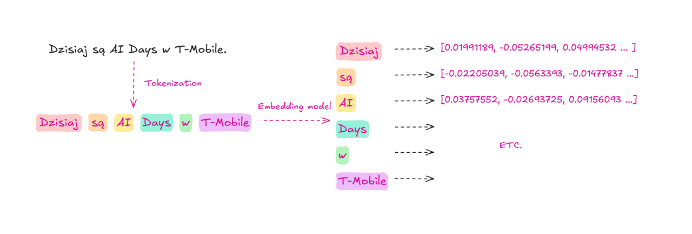
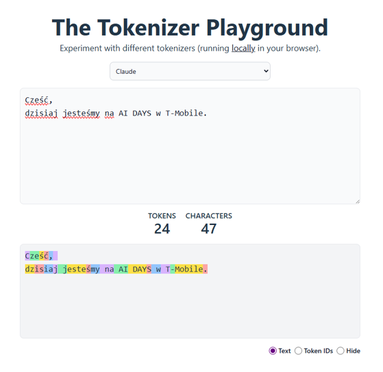
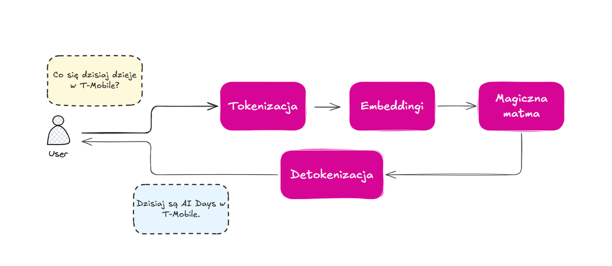
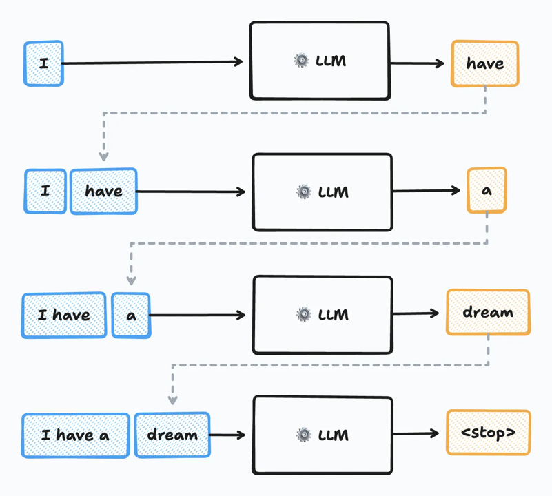
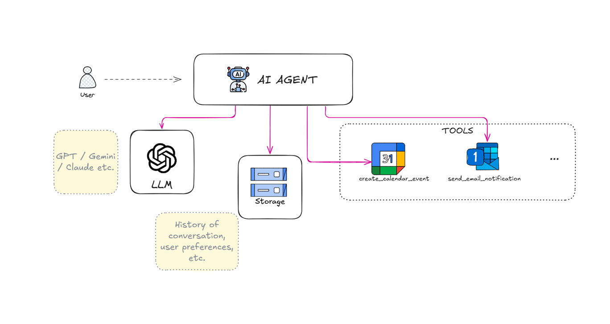
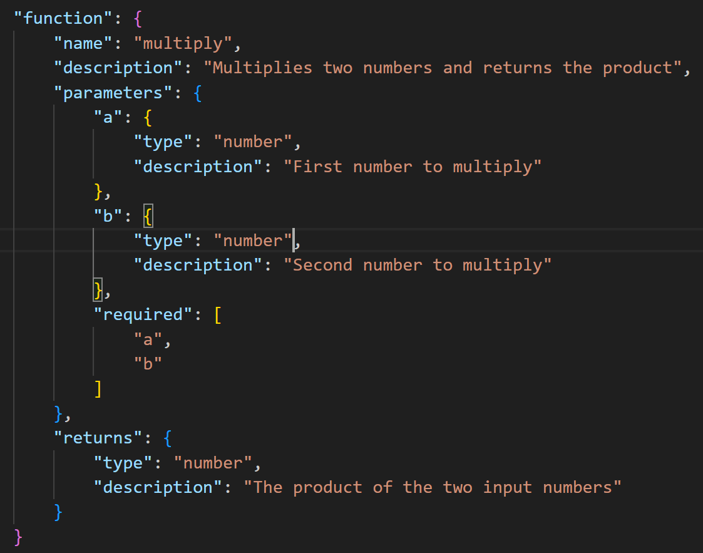

# Tokenizacja

### Tokenizacja vs embedding



### Tokenization playground

[LINK](https://huggingface.co/spaces/Xenova/the-tokenizer-playground)



### Uproszczone chatbot flow



### LLM jest autoregresywny



### Materiały:

**Tokenizacja:**

- https://medium.com/data-science-collective/the-invisible-building-blocks-of-ai-what-you-need-to-know-about-tokenization-acadd86a63ba
- https://www.geeksforgeeks.org/nlp/nlp-how-tokenizing-text-sentence-words-works/

**Embeddingi:**

- https://www.geeksforgeeks.org/nlp/word-embeddings-in-nlp/
- https://www.ibm.com/think/topics/vector-embedding

**Generowanie tekstu:**

- https://www.geeksforgeeks.org/nlp/tokenization-vs-embeddings/
- https://pm.dartus.fr/posts/2025/how-llm-generate-text/

# Agenci

### Architektura agenta



### Narzędzia



### Materiały:

- https://medium.com/@maximilian.vogel/mastering-ai-agents-the-10-best-free-courses-tutorials-learning-tools-46bc380a19d1
- https://huggingface.co/learn/agents-course/unit0/introduction

# Prompting demo

### Podstawowy prompt

Jestem pracownikiem działu marketingu. Jak mogę się rozwijać?

### 1. Dodanie kontekstu

**Kontekst dla LLM**: Jestem pracownikiem działu marketingu w dynamicznie rozwijającej się firmie technologicznej. Chcę poszerzyć swoją wiedzę branżową w obszarach związanych z najnowszymi trendami w marketingu cyfrowym, analizie danych marketingowych oraz psychologii konsumenta. Moim celem jest bycie na bieżąco z innowacjami i podnoszenie swoich kwalifikacji, aby skuteczniej wspierać strategię firmy.

### 2. Zawężenie zakresu

Plan powinien skupiać się wyłącznie na rekomendacjach dotyczących:

- Kursów online i szkoleń branżowych: Zarówno płatnych, jak i darmowych, które są wysoko oceniane i aktualne.
- Książek: Kluczowych pozycji z wymienionych obszarów, zarówno klasycznych, jak i najnowszych publikacji.
- Wydarzeń branżowych (konferencje, webinary): Godnych uwagi wydarzeń w najbliższych 6-12 miesiącach.
- Narzędzi i zasobów AI: Konkretnych narzędzi AI, które mogą wspierać mnie w nauce lub praktycznym zastosowaniu zdobytej wiedzy (np. narzędzia do analizy trendów, personalizacji treści marketingowych).

### 3. Oczekiwany rezultat

Oczekiwany rezultat to lista punktów, zawierająca:

- **Tytuł/Nazwa**: Nazwa kursu, książki, wydarzenia lub narzędzia.
- **Krótki opis**: Streszczenie zawartości lub funkcji.
- **Dlaczego jest to istotne**: Wyjaśnienie, dlaczego dana pozycja jest wartościowa dla mojego rozwoju w kontekście marketingu.
- **Orientacyjny czas/koszt** (jeśli dotyczy): Szacowany czas trwania kursu/webinaru lub koszt książki/szkolenia.
- **Link/Źródło**: Bezpośredni link do kursu, strony książki, wydarzenia lub narzędzia (jeśli możliwe i bezpieczne).

Dodatkowo, proszę, aby rekomendacje były dostosowane do osoby, która ma już podstawowe doświadczenie w marketingu i szuka zaawansowanych treści.

### 4. Few-shot

**Przykładowe rekomendacje**:

1. **Kurs online: "Advanced Digital Marketing Strategies"**

   - **Opis**: Kurs skupiający się na zaawansowanych technikach marketingu cyfrowego, w tym SEO, SEM i analityce danych.
   - **Dlaczego istotne**: Pomaga zrozumieć skomplikowane strategie marketingowe i ich zastosowanie w praktyce.
   - **Czas/koszt**: 6 tygodni, koszt 500 PLN.
   - **Link**: [Przykładowy link do kursu](https://example.com)

2. **Książka: "Consumer Psychology in Marketing"**
   - **Opis**: Książka omawiająca psychologię konsumenta i jej wpływ na decyzje zakupowe.
   - **Dlaczego istotne**: Pomaga zrozumieć motywacje konsumentów i jak je wykorzystać w strategiach marketingowych.
   - **Czas/koszt**: 300 stron, koszt 80 PLN.
   - **Link**: [Przykładowy link do książki](https://example.com)

### 5. Formatowanie

```
<Instrukcja>
  Przygotuj 3-punktowy plan rozwoju osobistego dla nauki języka hiszpańskiego.
  Plan powinien być krótki, konkretny i w punktach.
</Instrukcja>

<Kontekst_Użytkownika>
  <Poziom_Początkowy>A1 (Podstawowy)</Poziom_Początkowy>
  <Dostępny_Czas>1 godzina dziennie</Dostępny_Czas>
  <Styl_Nauki>Wzrokowiec</Styl_Nauki>
</Kontekst_Użytkownika>

<Wymagany_Zakres>
  Skup się na: aplikacjach mobilnych, fiszkach cyfrowych i zasobach wizualnych.
  Wyklucz: tradycyjne podręczniki i długie teksty.
</Wymagany_Zakres>

```

Używanie tagów, takich jak XML (`<tag>`), w długich promptach pomaga modelom LLM (Large Language Models) udzielać lepszych odpowiedzi, ponieważ:

1.  **Strukturyzacja i Segmentacja Kontekstu:** Tagi działają jak wizualne i logiczne separatory, pomagając modelowi **wyraźnie rozróżnić** różne sekcje instrukcji, danych wejściowych, ograniczeń i oczekiwanego formatu wyjściowego. W długim prompcie, gdzie łatwo o zagubienie kontekstu, taga (np. `<Instrukcje>`, `<DaneWejściowe>`, `<KontekstFirmy>`) zapobiega pomieszaniu tych elementów.

2.  **Precyzyjne Wydobywanie Informacji:** Tagi umożliwiają modelowi **precyzyjne skupienie uwagi** na kluczowych fragmentach. Możesz poprosić model: "Użyj tylko informacji zawartych w tagu `<DaneWejściowe>`", co zmniejsza ryzyko "halucynacji" lub czerpania z ogólnej wiedzy na temat, na który dostarczasz konkretne informacje.

3.  **Wzmacnianie Ograniczeń (Constraint Enforcement):** Pomagają w **definiowaniu oczekiwanego formatu wyjściowego**. Możesz zażądać, aby model zwrócił odpowiedź w określonych tagach (np. `<Odpowiedź>`, `<Uzasadnienie>`), co jest szczególnie cenne przy automatyzacji procesów i integracji z innymi systemami.

**Podsumowując:** Tagi poprawiają **przejrzystość strukturalną** i **rozróżnianie semantyczne** w złożonych promptach, zwiększając tym samym trafność, precyzję i przewidywalność odpowiedzi modelu.

### 6. Chain-of-thought

"Jako mój osobisty konsultant ds. rozwoju kariery, pomóż mi stworzyć spersonalizowany plan rozwoju na najbliższe 6 miesięcy. Moim głównym celem jest **przejście na stanowisko menedżera produktu w branży FinTech**. Mam 3 lata doświadczenia jako analityk danych, ale brakuje mi formalnego doświadczenia w zarządzaniu produktem.

**Zastosuj metodę Chain of Thought do analizy i generowania planu:**

1.  **Analiza luki kompetencyjnej:**

    - **Krok 1:** Zidentyfikuj kluczowe umiejętności i wiedzę wymagane na stanowisku menedżera produktu w FinTech.
    - **Krok 2:** Porównaj te wymagania z moim obecnym profilem (analityk danych z 3-letnim doświadczeniem). Wskaż konkretne luki kompetencyjne i obszary do rozwoju (techniczne, miękkie, domenowe).
    - **Uzasadnienie:** Wyjaśnij, dlaczego te umiejętności są krytyczne dla sukcesu na stanowisku menedżera produktu w FinTech.

2.  **Generowanie strategii rozwoju:**

    - **Krok 1:** Na podstawie zidentyfikowanych luk, zaproponuj konkretne ścieżki rozwoju na najbliższe 6 miesięcy. Powinny one obejmować:
      - **Edukację formalną/nieformalną:** Kursy online (np. Coursera, edX), certyfikaty branżowe (np. Product Owner), książki, artykuły.
      - **Praktyczne doświadczenie:** Projekty poboczne, wolontariat, inicjatywy w obecnej firmie (np. liderowanie małym projektom, wspieranie PM-ów).
      - **Networking:** Spotkania branżowe, mentoring.
    - **Krok 2:** Wskaż, jak mogę wykorzystać narzędzia AI do wspierania każdej z tych ścieżek (np. AI do rekomendacji kursów, do generowania pomysłów na projekty, do analizy trendów rynkowych FinTech, do symulacji rozmów kwalifikacyjnych).
    - **Uzasadnienie:** Wyjaśnij, dlaczego te konkretne działania są najbardziej efektywne do szybkiego uzupełnienia luk i osiągnięcia celu.

3.  **Tworzenie harmonogramu i mierników sukcesu:**
    - **Krok 1:** Zaproponuj realistyczny, miesięczny harmonogram działań na te 6 miesięcy, uwzględniający priorytety i nakład pracy.
    - **Krok 2:** Zdefiniuj konkretne, mierzalne wskaźniki sukcesu (SMART goals) dla każdego miesiąca i dla całego planu.
    - **Uzasadnienie:** Wyjaśnij, w jaki sposób będziemy monitorować postępy i jak te mierniki pomogą ocenić skuteczność planu.

**Oczekiwany output:** Szczegółowy plan rozwoju, z wyraźnie wydzielonymi sekcjami odpowiadającymi powyższym krokom CoT, zawierający uzasadnienia dla każdej decyzji i rekomendacji."

---

**Jak to działa (Chain of Thought):**

W tym prompcie zmuszasz AI do:

1.  **Analizy:** Zamiast od razu generować listę kursów, musi najpierw przemyśleć, jakie umiejętności są potrzebne i jakich Ci brakuje.
2.  **Uzasadnienia:** Dla każdej podjętej decyzji AI musi wyjaśnić, dlaczego ją podjęło. To buduje zaufanie i pozwala zweryfikować logikę.
3.  **Sekwencjonowania:** AI przechodzi przez logiczne etapy (analiza -> strategia -> harmonogram), co prowadzi do bardziej spójnego i kompleksowego wyniku.

Dzięki temu, nawet jeśli AI nie "trafiłoby" idealnie, zobaczysz jego proces myślowy i będziesz mógł precyzyjniej skorygować prompt w kolejnej interakcji.

## Materiały:

**Ogólne:**

- [Hugging Face prompt engineering theory](https://huggingface.co/docs/transformers/en/tasks/prompting)
- [Prompt engineering full guide](https://www.promptingguide.ai/)
- [Short guide](https://aalapdavjekar.medium.com/all-the-wrong-and-right-ways-to-prompt-a-tiny-guide-5bd119d312b3)

**Instrukcje dla konkretnych modeli:**

- [OpenAI](https://platform.openai.com/docs/guides/prompt-engineering)
- [Claude](https://docs.claude.com/en/docs/build-with-claude/prompt-engineering/overview)

**Playgrounds:**

- [Hugging Face](https://huggingface.co/playground)
- [Google AI Studio](https://aistudio.google.com/)
